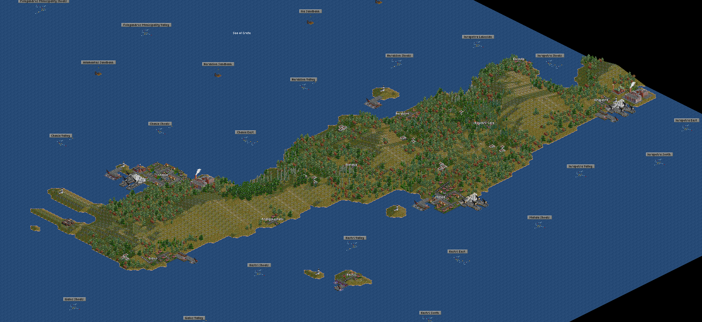
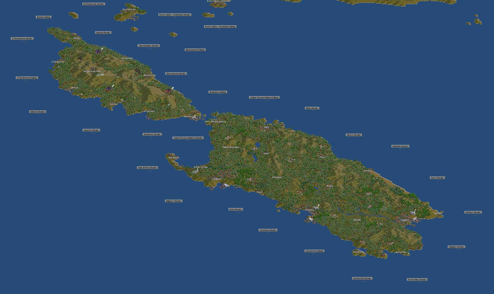
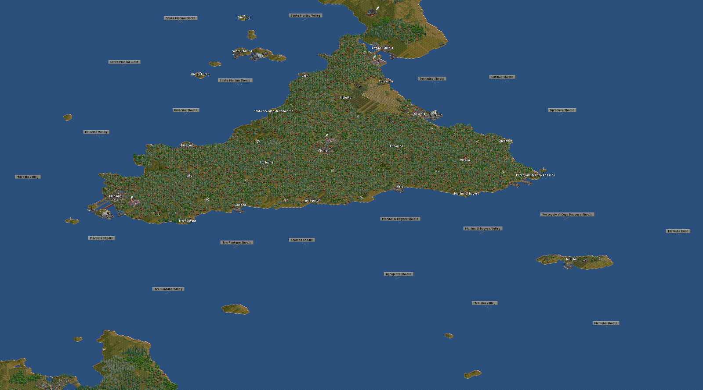
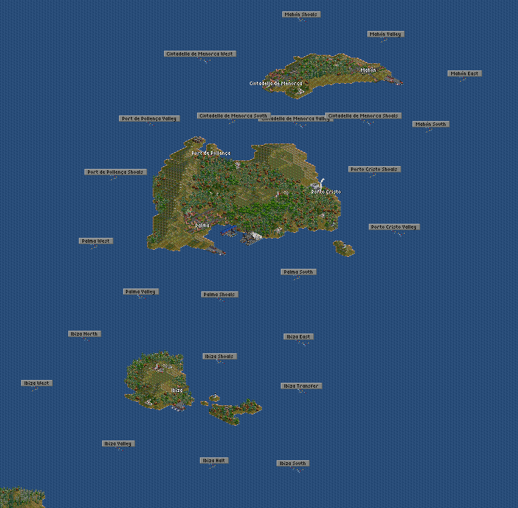
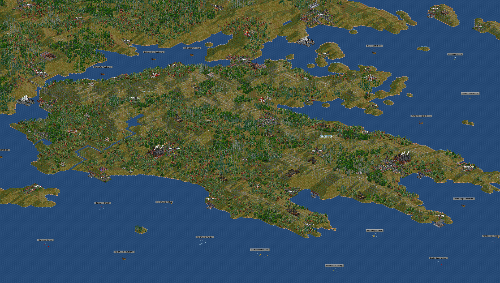
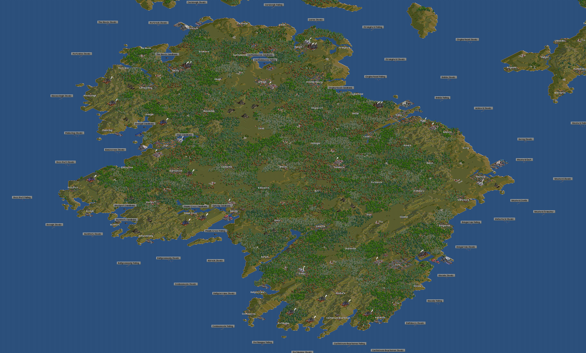

# 2k-Europe-FIRS3
A 2k by 2k Openttd Map of Europe with FIRS3 Support

### Introduction

Hello, This is my first Openttd Scenario so give me a little break. Of course any suggestions are nice.

I have constantly played on tons of heightmaps of europe, but having them have all the default openttd city names irked me the wrong way. So i finally decided to bite the bullet and design my own. Currently I am making it with FIRS3 support as that is what i normally play with. 

I have a lot of mods on, but will also be removing all of them except only the neccessary ones. Of course you can always edit the scenario yourself to add or remove newgrf's as you please. I intend that the start date should be early 1800's. As always you can change it. In the future I also want to modify the map to be vanilla too but that will be a lot later.

This is also meant for multiplayer games because of how large it is so have fun!

## Dependencies

All of the Newgrf's except for FIRS3 (as of the time of writing this) are available through the in game content manager. You have to go to the FIRS website to download the newest version of FIRS for this map (https://bundles.openttdcoop.org/firs/releases/LATEST/docs/html/get_started.html#download-firs).

### Credits

Thanks to, 
-TinyMusic for the map, it would have been impossible if he hadn't uploaded it to BaNNaNas.
-The FIRS team for their amazing industry replacement set.

### Screenshots

The Island of Crete, not fully on the heightmap. Nevertheless theres enough it will do.

The two islands of corsica and sardinia respectivley, I might revise and remove some of the towns it may be too crowded for tains.

Wil be reworked as there are too many trees, my first part of the project so it was to be suspected it would not come out the best!

The small island of Mallorca off the coast of Spain, my favorite part of the project so far.

The Greek islands are quite cool with their verticallity, just hope im giving enough room for trains.

Finished Ireland, I personally think it looks great, may comeback and touch it up a bit. You can barely see whales off in the distance.

## Changelog

Alpha V1.35{
+1/3 the way done with the UK
}

Alpha V1.34{
+Added Ireland Screenshot
+Sort of finished wales, may comeback to it when i finish rest of UK
+Partly done with Cornwall
}

Alpha V1.33{
+Finished Ireland
}

Alpha V1.32{
+Halfway done with Ireland
+More house keeping
+Added Screenshots and Descriptions

Alpha V1.31{
-Changed file names
-Did some house keeping
-Added Name of Original Heightmap Creator
}

Alpha V1.3{
-Added More Capitals with some flurish
-Started on Ireland
}

Alpha V1.2{
-Added a Few Capitals
}

Alpha V0.11{
-Actually Finished Ionian islands
-Finished Greek Islands
-Finished Peleponese Pininsula
}

Alpha V0.1{
-Finished Sicily
-Finished Ionian Islands
-Finished Crete
}
